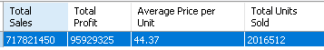
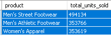
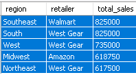
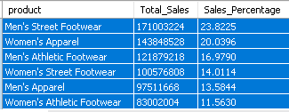
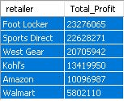

# Adidas-Sales-Analysis

Problem Statement
The objective of this project is to analyze the Adidas sales database for the year 2021 and identify key insights to help improve sales performance and optimize business strategies. By analyzing the sales data, we aim to understand factors influencing sales, identify trends, and uncover opportunities for growth. 

<font size="15"><B>Background</B></font>

Sales are a fundamental aspect of any business. 
In this project, I'll analyze two tables repurposed from the Adidas Sales Dataset in Kraggle to answer the following questions:

1.What is the overall sales, profit, average price per unit, and total units sold.

2.What is the revenue generated by each product, ranked from highest to lowest?

2.What are the top three products on highest demand in terms of quantity?

3.Which retailers have the most sales per state?

4.Are there any interesting patterns as to when customers buy more products in terms of seasonality?

📊 Methodoly

I started off with two Excel files. The first Excel file, Adidas US Sales (as its name suggests), had information on transaction id, retailer, retailer id, invoice date, product, prices per unit, units sold, and sales method. 
The second Excel file, Adidas US Locations, had information on transaction id, region, state, and city. 
Here's the step-by-step of the methodology I followed:

Creating empty tables

In order to import the information on the Excel files into PostgreSQL, I had to create an empty table for each Excel sheet. These empty tables must contain the same column name of the headers while keeping in mind the data type, and column constraints.

I created the first table "adidas_sales" with the following code:
```CREATE TABLE adidas_sales (transaction_id SERIAL PRIMARY KEY,retailer VARCHAR(50) NOT NULL,retailer_id INTEGER NOT NULL,invoice_date TIMESTAMP NOT NULL,product VARCHAR(50) NOT NULL,price_per_unit INTEGER NOT NULL,units_sold INTEGER NOT NULL,total_sales INTEGER NOT NULL,sales_method VARCHAR(50) NOT NULL ); ```

Then I created the second empty table "locations" with this query:```CREATE TABLE locations (transaction_id INTEGER REFERENCES adidas_sales(transaction_id),region VARCHAR(25) NOT NULL,state VARCHAR(25) NOT NULL,city VARCHAR(25) NOT NULL ); ```

Then I saved the two Excel files as CVS files and imported them into their corresponding table in MySQL.

Joining tables

The information I needed to solve all the questions above is in both adidassales and locations. Since both of these have the transactionid column in common, I can use the command INNER JOIN to analyze data from just one "master" table.

 ```SELECT * FROM adidas_sales INNER JOIN locations ON adidas_sales.transaction_id = locations.transaction_id; ```

💡 Results

<font size="12"><B>1. Total Sales, Total Profit, Average Price per Unit, and Total Units Sold:</B></font>  
Here's the SQL query for that:<br> ```
SELECT 
    SUM(total_sales) AS "Total Sales",
    SUM(price_per_unit * units_sold) AS "Total Profit",
    Round(AVG(price_per_unit),2) AS "Average Price per Unit",
    SUM(units_sold) AS "Total Units Sold"
FROM
    adidas_sales; ```<br>
    And this is the data output:<br>
      <br>
The overall sales for 2021 combined is $717,821,450.<br>
The overall profit generated within this time frame is $95,929,325.<br>
The total units sold amount to 2,016,512 units.<br>
The average price per unit sold is $44.37.<br>

<font size="12"><B>2.What are the top three products on highest demand in terms of quantity?</B></font><br>
Here's the SQL query for that:<br> ```SELECT product, SUM(units_sold) AS Total_units_sold FROM adidas_sales
 GROUP BY product 
 ORDER BY total_units_sold 
 DESC LIMIT 3;```<br>
 And this is the data output:<br>
      <br>The three product categories in the highest demand are "Men's Street Footwear", "Men's Athletic Footwear", and "Women's Apparel".<br>
    <font size="12"><B>3.Find the Retailer with the highest total sales in each region?</B></font><br> 
   Here's the SQL query for that:<br> ```WITH max_region_sales AS (
    SELECT l.region, MAX(s.total_sales) as max_total_sales
    FROM adidas_sales s
    JOIN locations l ON s.transaction_id = l.transaction_id
    GROUP BY l.region
)
SELECT l.region, s.product, SUM(s.total_sales) as total_sales
FROM adidas_sales s
JOIN locations l ON s.transaction_id = l.transaction_id
JOIN max_region_sales mrs ON l.region = mrs.region
WHERE s.total_sales = mrs.max_total_sales
GROUP BY l.region, s.product
ORDER BY l.region;```<br>
 And this is the data output:<br>
      <br>
Walmart is the top-performing Retailer in the South region with a total sales of $825,000.
West Gear is the top-performing Retailer in the West region with a total sales of $735,000.
Amazon is the top-performing Retailer d in the Midwest region with a total sales of $618,750.
West Gear is the top-performing Retailer in the Northeast region with a total sales of $617,500.
<br>

<font size="12"><B>4.Calculate the total sales and percentage contribution of each product category to the overall sales?</B></font><br>
Here's the SQL query for that:<br> ```SELECT product, 
       SUM(total_sales) as total_Sales,
	   (SUM(total_sales) / (SELECT SUM(total_sales) FROM adidas_sales)) * 100 as sales_percentage
FROM adidas_sales
GROUP BY product
order by sales_percentage desc```<br>
 And this is the data output:<br>
      <br>The top performing product category is Men's Street Footwear the with a total sales of 23.85% of the overall sales.<br>

<font size="12"><B>5.Which retailers have the most sales per state?</B></font><br>
To answer this question, I'll need to perform the following steps:<br>
1.Calculate the total sales for each retailer and state combination <br>
2.Rank the retailers within each state based on their total sales <br>
3.Select the retailer with the highest total sales in each state <br>
Here's the SQL query for that:<br> ```WITH retailer_state_sales AS 
( SELECT l.state,
 ad.retailer, SUM(ad.price_per_unit * ad.units_sold) AS total_sales 
 FROM adidas_sales ad
 INNER JOIN locations l
 ON ad.transaction_id = l.transaction_id 
 GROUP BY l.state, ad.retailer )
 ,ranked_retailers AS 
 ( SELECT state, retailer, total_sales, 
 ROW_NUMBER() OVER (PARTITION BY state ORDER BY total_sales DESC) AS rk 
 FROM retailer_state_sales )
 SELECT state, retailer, total_sales 
 FROM ranked_retailers WHERE rk = 1; ```<br>
 And this is the data output:<br>
  <br> <br>Alabama's top retailer is Sports Direct, Alaska in Amazon and Arizona in Footlocker.<br>
