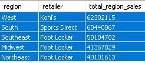

# Adidas-Sales-Analysis

## Problem Statement
The objective of this project is to analyze the Adidas sales database for the year 2021 and identify key insights to help improve sales performance and optimize business strategies. By analyzing the sales data, we aim to understand factors influencing sales, identify trends, and uncover opportunities for growth. <br>
## Background
Sales are a fundamental aspect of any business. <br>
In this project, I'll analyze two tables repurposed from the Adidas Sales Dataset in Kraggle to answer the following questions:<br>
1.What is the overall sales, profit, average price per unit, and total units sold.<br>
2.What are the top three products on highest demand in terms of quantity?<br>
3.Find the Retailer with the highest total sales in each region?<br>
4.Calculate the total sales and percentage contribution of each product category to the overall sales?<br>
5.Which retailers have the most sales per state?<br>
6.Are there any interesting patterns as to when customers buy more products in terms of seasonality?<br>
7.What is the revenue generated by each product, ranked from highest to lowest?<br>
8.What is the total profit generated by each retailer?<br>
9.Identify the top 5 performing cities based on profit.<br>
## 📊 Methodoly
I started off with two Excel files. The first Excel file, Adidas US Sales (as its name suggests), had information on transaction id, retailer, retailer id, invoice date, product, prices per unit, units sold, and sales method. 
The second Excel file, Adidas US Locations, had information on transaction id, region, state, and city. 
Here's the step-by-step of the methodology I followed:<br>
Creating empty tables<br>
In order to import the information on the Excel files into PostgreSQL, I had to create an empty table for each Excel sheet. These empty tables must contain the same column name of the headers while keeping in mind the data type, and column constraints.<br>
I created the first table "adidas_sales" with the following code:<br>
```CREATE TABLE adidas_sales (transaction_id SERIAL PRIMARY KEY,retailer VARCHAR(50) NOT NULL,retailer_id INTEGER NOT NULL,invoice_date TIMESTAMP NOT NULL,product VARCHAR(50) NOT NULL,price_per_unit INTEGER NOT NULL,units_sold INTEGER NOT NULL,total_sales INTEGER NOT NULL,sales_method VARCHAR(50) NOT NULL ); ```<br>
Then I created the second empty table "locations" with this query:```CREATE TABLE locations (transaction_id INTEGER REFERENCES adidas_sales(transaction_id),region VARCHAR(25) NOT NULL,state VARCHAR(25) NOT NULL,city VARCHAR(25) NOT NULL ); ```<br>
Then I saved the two Excel files as CVS files and imported them into their corresponding table in MySQL.<br>
Joining tables<br>
The information I needed to solve all the questions above is in both adidassales and locations. Since both of these have the transactionid column in common, I can use the command INNER JOIN to analyze data from just one "master" table.<br>
 ```SELECT * FROM adidas_sales INNER JOIN locations ON adidas_sales.transaction_id = locations.transaction_id; ```<br>
## 💡 Results

<font size="12"><B>1. Total Sales, Total Profit, Average Price per Unit, and Total Units Sold:</B></font>  <br>
Here's the SQL query for that:<br> ```
SELECT 
    SUM(total_sales) AS "Total Sales",
    SUM(price_per_unit * units_sold) AS "Total Profit",
    Round(AVG(price_per_unit),2) AS "Average Price per Unit",
    SUM(units_sold) AS "Total Units Sold"
FROM
    adidas_sales; ```<br>
    And this is the data output:<br>
      <br>
The overall sales for 2021 combined is $717,821,450.<br>
The overall profit generated within this time frame is $95,929,325.<br>
The total units sold amount to 2,016,512 units.<br>
The average price per unit sold is $44.37.<br>

<font size="12"><B>2.What are the top three products on highest demand in terms of quantity?</B></font><br>
Here's the SQL query for that:<br> ```
SELECT product, SUM(units_sold) AS Total_units_sold FROM adidas_sales
 GROUP BY product 
 ORDER BY total_units_sold 
 DESC LIMIT 3;```<br>
 And this is the data output:<br>
      <br>The three product categories in the highest demand are "Men's Street Footwear", "Men's Athletic Footwear", and "Women's Apparel".<br>
    <font size="12"><B>3.Find the Retailer with the highest total sales in each region?</B></font><br> 
   Here's the SQL query for that:<br>```
   SELECT
  region,
  retailer,
  total_region_sales
FROM (
  SELECT
    l.region,
    s.retailer,
    SUM(s.total_sales) AS total_region_sales,
    ROW_NUMBER() OVER (PARTITION BY l.region ORDER BY SUM(s.total_sales) DESC) AS sales_rank
  FROM
    adidas_sales s
    JOIN locations l ON s.transaction_id = l.transaction_id
  GROUP BY
    l.region, s.retailer
    order by total_region_sales desc
) AS rankedSales
WHERE
  sales_rank = 1;```<br>
 And this is the data output:<br>
      <br>
Kohl's is the top-performing Retailer in the West region with a total sales of $62,302,115.
Sports Direct is the top-performing Retailer in the South region with a total sales of $60,440,067.
Foot Locker is the top-performing Retailer in the Southeast region,Midwest region and Northeast region with a total sales of $50,104,782 and $41,367,829, $40,101,613.
<br>

<font size="12"><B>4.Calculate the total sales and percentage contribution of each product category to the overall sales?</B></font><br>
Here's the SQL query for that:<br> ```SELECT product, 
       SUM(total_sales) as total_Sales,
	   (SUM(total_sales) / (SELECT SUM(total_sales) FROM adidas_sales)) * 100 as sales_percentage
FROM adidas_sales
GROUP BY product
order by sales_percentage desc```<br>
 And this is the data output:<br>
      <br>The top performing product category is Men's Street Footwear the with a total sales of 23.85% of the overall sales.<br>

<font size="12"><B>5.Total Profit generated by each reatailer?</B></font><br>
 Here's the SQL query for that:<br>```
 SELECT
retailer,
    SUM(price_per_unit *units_sold) AS Total_Profit
    FROM
    adidas_sales 
    GROUP BY
    retailer
    order by Total_Profit desc ```<br>
 And this is the data output:<br>
  <br> West Gear and Foot Locker emerged as the top-performing retailers, generating profits of $23,276,065.18 and $22,628,271, respectively.<br>

<font size="12"><B>6.Are there any interesting patterns as to when customers buy more products in terms of seasonality?</B></font><br>
Here's the SQL query for that:<br> ```SELECT 
CASE WHEN EXTRACT(MONTH FROM invoice_date) IN (12, 1, 2) THEN 'Winter' 
WHEN EXTRACT(MONTH FROM invoice_date) IN (3, 4, 5) THEN 'Spring' 
WHEN EXTRACT(MONTH FROM invoice_date) IN (6, 7, 8) THEN 'Summer' 
WHEN EXTRACT(MONTH FROM invoice_date) IN (9, 10, 11) THEN 'Autumn' 
END AS Season, 
SUM(price_per_unit * units_sold) AS Total_Sales 
FROM adidas_sales 
GROUP BY season 
ORDER BY total_sales desc; ```<br>
 And this is the data output:<br>
  <br>The only pattern or insight you can get from this table is that sales are at their highest in the summer.<br>

<font size="12"><B>7.What is the revenue generated by each product, ranked from highest to lowest?</B></font><br>
Here's the SQL query for that:<br> ```SELECT product, SUM(total_profit) AS Profit
FROM (SELECT adidas_sales.product, (adidas_sales.price_per_unit * adidas_sales.units_sold) AS total_profit
FROM adidas_sales 
) AS subquery
 GROUP BY product 
 ORDER BY Profit DESC; ```<br>
 And this is the data output:<br>
  <br>From this, you can conclude that the product category that brings the most revenue is "Men's Street Footwear", while "Women's Athletic Footwear" is at the bottom.<br>

<font size="12"><B>8.What is the total profit generated by each retailer?</B></font><br>
Here's the SQL query for that:<br> ```SELECT 
    retailer,
    SUM(price_per_unit * units_sold) AS total_profit
FROM
    adidas_sales
GROUP BY
    retailer
ORDER BY
    total_profit DESC; ```<br>
 And this is the data output:<br>
  <br>From this, you can conclude that the Foot Locker and Sports Direct and West Gear emerged as the top-performing retailers.<br>

 <font size="12"><B>9.Identify the top 5 performing cities based on profit:</font></B><<br> ```SELECT 
    l.city,
    SUM(a.price_per_unit * a.units_sold) AS Total_profit, retailer
FROM
    adidas_sales a
JOIN
    locations l ON a.transaction_id = l.transaction_id
GROUP BY
    l.city, retailer
ORDER BY
    total_profit DESC
LIMIT 5; ```<br>
 And this is the data output:<br>
<br>Kohl's is the top performing retailer in Los Angeles with a profit of $3,578,910.
West Gear leads in San Francisco with a profit of $3,514,507.
Foot Locker is the top performer in Charleston with a profit of $3,449,802.
In Portland, West Gear is the top performing retailer with a profit of $3,118,632.
Walmart leads in Orlando with a profit of $2,992,039.<br>

## Conclusion
In conclusion, the analysis of the Adidas sales has provided valuable insights into the performance of the business. Here are the key findings:<br>
```1.Overall Sales and Profit generated in 2021: The overall sales for 2021 combined is $717,821,450. The overall profit generated within this time frame is $95,929,325.```<br>
```2.Top Performing Retailers:West Gear and Foot Locker emerged as the top-performing retailers, generating profits of $23,276,065.18 and $22,628,271, respectively. Strengthening partnerships with these retailers can lead to further growth and success.```<br>
```3.Seasonal Sales Pattern:This pattern suggests that more sales occur during the summer season. Adidas has two total sales major peaks, one during summer and one in December. Understanding this seasonal trend can help in planning marketing campaigns and inventory management.```<br>
```4.Seasonal Sales Pattern:This pattern suggests that more sales occur during the summer season. Adidas has two total sales major peaks, one during summer and one in December. Understanding this seasonal trend can help in planning marketing campaigns and inventory management.```<br>
```5.Product Category Analysis: Men's Street Footwear,Women's Apparel and Men's Athletic Footwear emerged as the top-selling product category.```<br>
```6.Sales Method Effectiveness: In-store sales proved to be the most effective method, generating sales worth $262,740,750. On the other hand, Outlet sales performed comparatively lower, with total sales of $211,927,784. It is important to enhance the online sales platform and implement targeted digital marketing strategies to boost online sales.```<br>
```7.Regional and City Analysis: The West region outperformed other regions, with total sales of $193,048,029. Among cities, Charleston emerged as the top performer, generating sales worth $39,974,797.```<br>

## Recommendation
```•Capitalize on the growth trend by investing in marketing, product innovation, and customer engagement strategies.```<br>
```•Strengthen partnerships with top-performing retailers to optimize product placement and explore co-marketing opportunities.```<br>
```•Implement strategies to optimize operations in the summer, considering the significance in sales. This may include increased staffing, special promotions, or tailored product offerings.```<br>
```•Enhance the online and outlet sales platform, improve user experience, and invest in targeted digital marketing campaigns to boost online sales.```<br>
```•Consider expanding operations in high-performing regions and target cities with growth potential. ```<br>
```•Gather and analyze customer feedback and preferences to better understand their needs, tailor marketing messages, and optimize product offerings.```<br>


